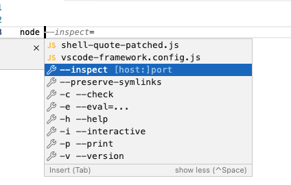
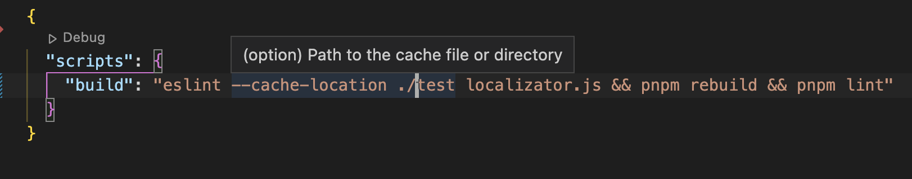
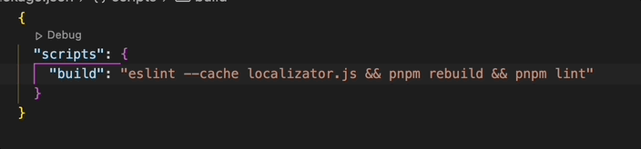
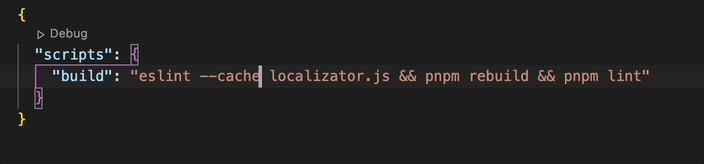
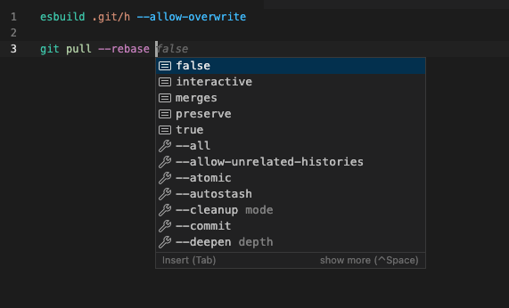
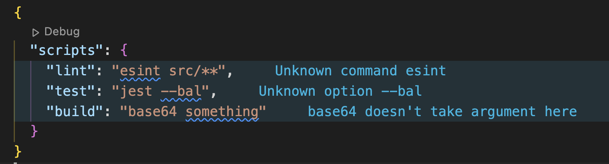
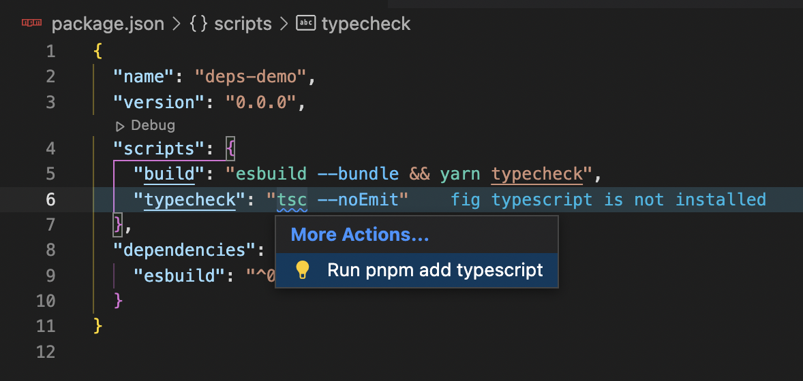
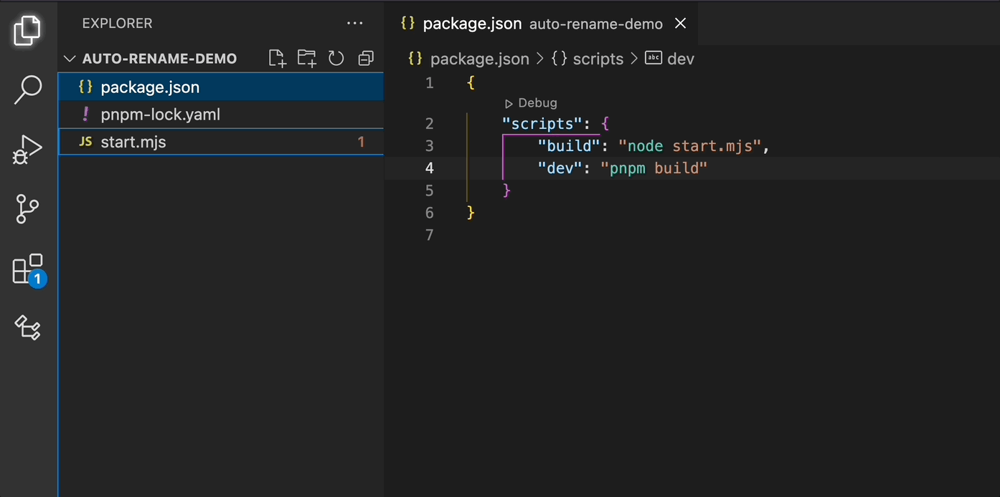
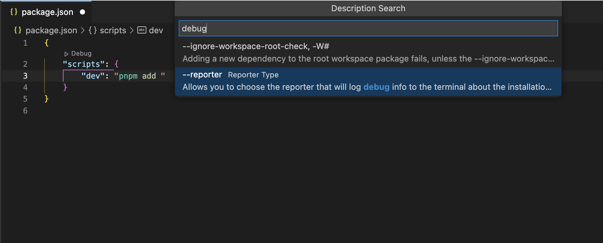

# FIG UNRELEASED

> Welcome!

## Contributing Providers

> Here, in quote I'm describing what is benefit of using Fig OSS autocomplete

### Completion

### Hover

Giving a subcommand, argument or option description.

### Definition

For now using only to quickly navigate (ctrl+click) to files, so
> Fig can tell, which argument is possibly a file path.

### Rename

> Fig can tell, which argument is possibly a file path.

Hit F2 to rename the file / change path in filesystem.

Note that this is the same as manual renaming in explorer, just a quicker way to do that.

### Selection Range

| Before                           | After                           |
| -------------------------------- | ------------------------------- |
|  |  |

*Command: > Expand Selection*

### Semantic Highlighting

### Linting

Would be disabled by default.

- ideas/problems:
  - file path validation. Limitation: unknown when its okay to reference file that doesn't exist: generated (or maybe output file?)
  - some subcommands/commands take any options. Examples: `node build.js --watch`, `webpack serve --mode`
  - arg validation from suggestions

#### Specs From npm Packages

*(only for package.json scripts)*

For some specs we can check wether its npm package is installed. With this you can ensure that command from local package is being used (instead from global one, like `tsc` for example).

All rules are configurable and can be disabled individually.

### Update Paths on File Rename

### Description Search

There is a command: *> Fig Unreleased: Description Search* that lets you to search option by its description.

## API

This extension supports API, which you can use to:

- Add support to your language, like `xml`
- Add support for new specs
- Use extension's known specs

See more at [./extension-api.md](./extension-api.md)

### Use Development Specs

Use `npm link` or `pnpm link` with path to your local version of `@withfig/autocomplete` repo.

To start extension, run `pnpm start` and hit F5 in VS Code to start extension debugging.
